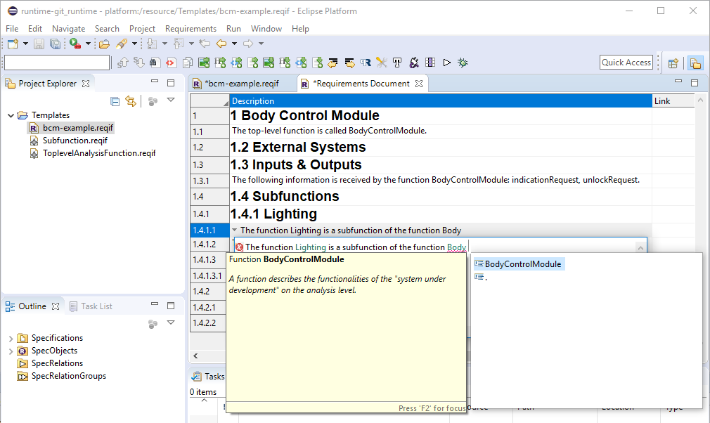

# ReqPat
### Efficient Documentation of High-Quality Requirements using Controlled Natural Language

Watch a short [intro video](https://youtu.be/ABHAuItsoaQ)

### Motivation
- Increasing complexity of intelligent technical systems
- Increasing size of requirements specifications
- Required compliance to domain-specific development standards

### Benefits
- High-quality requirements by design
- Reduced effort for requirements reviews and transition to model-based development
- Improved traceability and impact analysis from textual requirements to model-based work products

#### Constructive Support for Requirements Documentation
- Context-based pattern suggestions
- Auto completion
- Error highlighting

#### Automatic Analyses for Requirements Validation
- Syntactic checks while writing
- Semantic checks by the press of a button

### Installation
Tested with Eclipse Release "2019-06"

1. Download, install and run [Eclipse Modeling Tools 2019-06](https://www.eclipse.org/downloads/packages/)
2. Add the following update sites using the "Install new software" menu entry in the "Help" menu
    - Sphinx: http://download.eclipse.org/sphinx/releases/0.11.x
    - RMF Update Site: http://download.eclipse.org/rmf/updates/releases
    - (Optional) UnitTests: https://dl.bintray.com/itemis/generic/xtext-testing/updates/
3. Install the following extensions:
	- XText Complete SDK
	- Sphinx Runtime
	- RMF
	- OCL Examples and Editors SDK
	- (Optional) XText Testing (for the unit tests)
4. Clone the ReqPat Git Repository into your Eclipse workspace
5. Create and run a new "Run Configuration" in Eclipse of type "Eclipse Application"
6. Copy the "Templates" project into the runtime workspace
7. Read the [User Guide](documents/ReqPat-RMF_UserGuide_Tutorial.pdf)

### Publications
Fockel, Markus: Safety Requirements Engineering for Early SIL Tailoring. PhD thesis, Faculty for Computer Science, Electrical Engineering and Mathematics, Paderborn University, Dec 2018

Fockel, Markus; Holtmann, Jörg: ReqPat: Efficient Documentation of High-quality Requirements using Controlled Natural Language. In: Proc. of the 23rd International Requirements Engineering Conference 2015 (RE15), Aug 2015, IEEE

Fockel, Markus; Holtmann, Jörg: A Requirements Engineering Methodology Combining Models and Controlled Natural Language. In: 4th International Model-Driven Requirements Engineering Workshop (MoDRE), Karlskrona, Sweden, Aug 2014, IEEE

Fockel, Markus; Holtmann, Jörg; Meyer, Matthias: Mit Satzmustern hochwertige Anforderungsdokumente effizient erstellen. OBJEKTspektrum, (RE/2014), June 2014

Daun, Marian; Fockel, Markus; Holtmann, Jörg; Tenbergen, Bastian: Goal-Scenario-Oriented Requirements Engineering for Functional Decomposition with Bidirectional Transformation to Controlled Natural Language. Case Study "Body Control Module". May 2013

Fockel, Markus; Heidl, Peter; Höfflinger, Jens; Hönninger, Harald; Holtmann, Jörg; Horn, Wilfried; Meyer, Jan; Meyer, Matthias; Schäuffele, Jörg: Application and Evaluation in the Automotive Domain. In: Pohl, Klaus; Hönninger, Harald; Achatz, Reinhold; Broy, Manfred (eds.) Model-Based Engineering of Embedded Systems - The SPES 2020 Methodology, pp. 157-175. Springer, 2012

Fockel, Markus; Holtmann, Jörg; Meyer, Jan: Semi-automatic Establishment and Maintenance of Valid Traceability in Automotive Development Processes. In: 2nd International Workshop on Software Engineering for Embedded Systems (SEES), pp. 37–43, 2012
